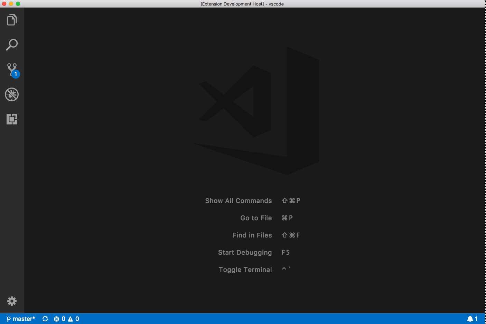

# Hello World Sample [ReScript]

This is a Hello World example that shows you how to use VS Code API.

Guide for this sample: https://code.visualstudio.com/api/get-started/your-first-extension.

## Demo

## VS Code API

### `vscode` module

- [`commands.registerCommand`](https://code.visualstudio.com/api/references/vscode-api#commands.registerCommand)
- [`window.showInformationMessage`](https://code.visualstudio.com/api/references/vscode-api#window.showInformationMessage)

### Contribution Points

- [`contributes.commands`](https://code.visualstudio.com/api/references/contribution-points#contributes.commands)

## Running the Sample

- Run `npm install` in terminal to install dependencies
- Run the `Run Extension` target in the Debug View. This will:
	- Start a task `npm: watch` to compile the code
	- Run the extension in a new VS Code window

### Notes for ReScript

- This project only contains the ReScript bindings for the hello-world example. More to be added.
- I am using the <code>js-post-build</code> config option in the <code>rescript.json</code> to rename and move the <code>Extension.res</code> from the <code>src</code> to the <code>out</code> folder.
- Unfortunately, the <code>rescript-build</code> task is not terminated automatically once the debugger is stopped. So, remember to exit out manually. I have tried to handle this via a post debug task, but this also caused the <code>rescript-build</code> task to stop when the debug window is reloaded.